# Завдання №9

**Тема**: Дослідження кольорових гармоній та інструментів аналізу Adobe Color

# Практичне завдання

## 1. Створення палітри для кожного типу гармонії:

Вибраний базовий колір — \#abcdf0

### Analogous

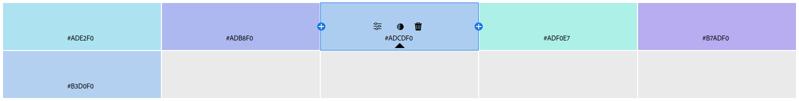

**Опис**

Спокійна та гармонійна гама з кольорами, які знаходяться поруч на колі.
Гармонійні, м’які комбінації, зі зниженим контрастом. Ідеальна для природних
та ненасичених образів.

### Monochromatic

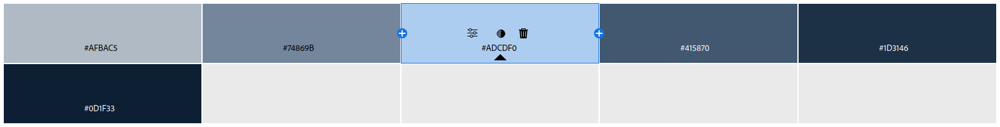

**Опис**

Відтінки одного кольору в різній насиченості та яскравості. Створює чисту й
стриману, однак візуально одноманітну композицію.

### Triad

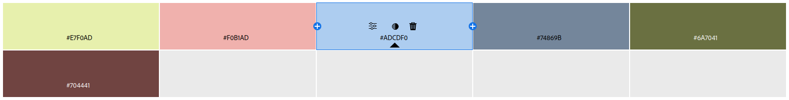

**Опис**

Три кольори, рівномірно розташовані на колі. Яскрава та контрастна, але потребує
балансу.

### Complementary

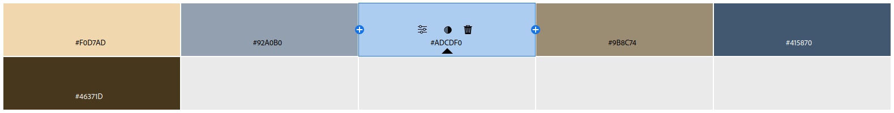

**Опис**

Два протилежні кольори на колірному колі. Максимальний контраст і візуальна
напруга. Може бути агресивним при надмірному використанні.

### Split Complementary

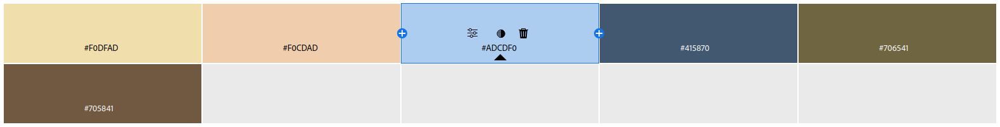

**Опис**

Один основний колір і два суміжні до комплементарного. Має менше напруги,
ніж у комплементарній схемі, але все зберігає контраст.

### Square

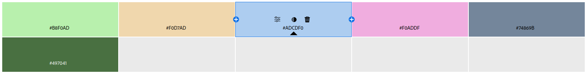

**Опис**

Чотири кольори, рівновіддалені на колірному колі. Палітра багата та динамічна,
однак вимагає обмеженого використання.

### Custom

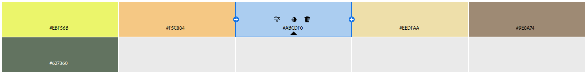

**Опис**

Вільний вибір кольорів без чітких правил. Створення власної палітри вимагає
гарного відчуття кольору задля уникнення дисгармонії.

2. Створення палітри зображенням

### Вхідне зображення

### Colorful Mood

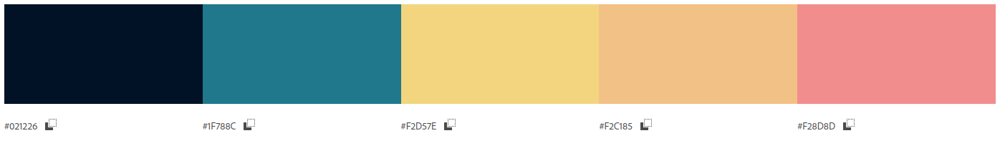

### Muted Mood

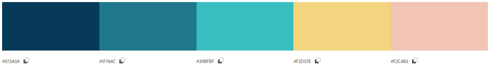

### Яка палітра краща?

Для інтерфейсу додатку більш доречно використовувати палітру "Muted Mood",
оскільки вона візуально спокійніша, не перевантажує око та краще підходить для
тривалого користування. Стримані кольори не відволікають від основного контенту,
забезпечують хорошу читабельність і мають сучасний, професійний вигляд. Крім
того, така палітра легше адаптується до світлої або темної теми та краще
поєднується з нейтральними кольорами. Усе це робить її більш універсальним і
функціональним рішенням для більшості типів застосунків.

## 3. Створення градієнту на основі зображення

### Вхідне зображення

### Градієнт

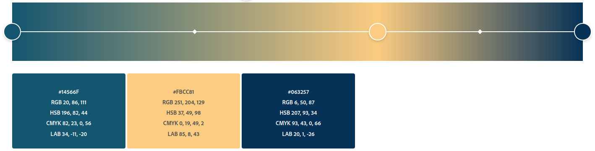

## 4. Аналіз контрасту

### Кольори

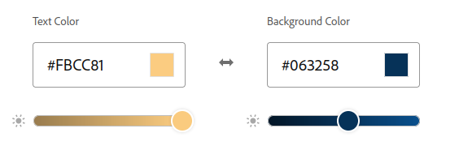

_За основу взято другий та третій кольори з градієнту, отриманого в попередньому
завданні._

### Рівень контрасту

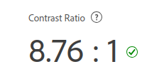

### Перевірка рівня контрасту на тексті та значках

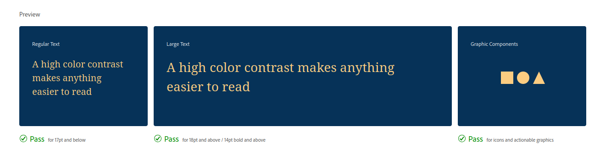

# Висновок

Оптимальний вибір кольорової гармонії для інтерфейсів залежить від їх
призначення, але найкраще себе зарекомендували аналогова та комплементарна
палітри. Аналогова гармонія створює спокійне та гармонійне враження, що добре
підходить для фінансових сервісів або корпоративних сайтів. Комплементарні
поєднання забезпечують чіткі акценти, важливі для кнопок і повідомлень.
Монохромна схема дозволяє створити стильний мінімалістичний дизайн, а тріада
підходить для креативних проєктів.

Крім того, кольори впливають на емоції: теплі відтінки активізують, а
холодні — заспокоюють. Вірно підібрана палітра не лише покращує UX, але й
підкреслює бренд, роблячи інтерфейс привабливим і функціональним.
